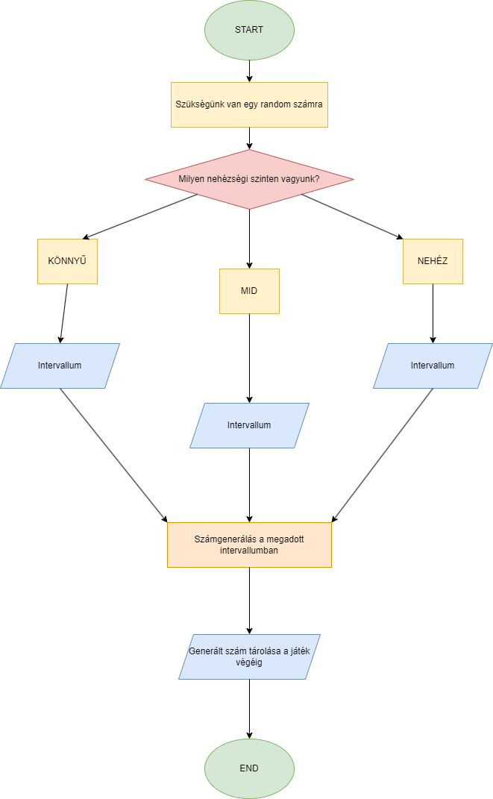

# Rendszerterv
# Rendszer:
Egyszerű számtippelésre alkalmas asztali felületű alkalmazás, amely bárki számára elérhető. Fő szempont, hogy csak szükséges mennyiségű kóddal, átlátható felhasználói felülettel egy gyorsan és rugalmasan működő fejlesztő játékot készítsünk. 

# Rendszer célja:
Egyszerű időtöltésre alkalmas, intuíció fejlesztő asztali alkalmazás, amely bárki számára elérhető. Célunk lenne a platformfüggetlenség, kevés erőforrással futtatható program, hogy nemtől és kortól függetlenül, de eszköz naprakészségétől függetlenül is bárki számára elérhető legyen a játék.

# Terv:
## Játékmenet folyamata

A játékmenet folyamata viszonylag egyszerű, annak ellenére is, hogy a folyamatábra alapján komplexnek tűnik.

### Kiindulás
User - A személy, aki aktuálisan játszani szeretne. Helyzettől függ a kiléte, lehet a tesztelő is, a megrendelő, vagy deployment után egy felhasználó. A rendszerterv ezen részében mint helytartó szó fog szerepelni.

A User elindítja az alkalmazást, betölt a GUI. Megadja a felhasználónevét az arra szolgáló rublikában.
Három gomb közül kiválaszthatja a neki megfelelő nehézségi szintet.
Lenyomja a start gombot, ez pedig meghív egy metódust, amely képes feldolgozni a megadott felhasználónevet és megnézi, adott-e meg a felhasználó nehézségi szintet. Ha túl hosszú és/vagy speciális karaktereket tartalmaz, új felhasználónevet kér. Ha nincs probléma a beírt felhasználónévvel, eltárolja azt. Ha üresen maradt a nehézségi szint, felszólítja a Usert, hogy válasszon szintet.

### A játék maga
A játék indulása után egy újabb metódus indul, amely megállapítja mely nehézségi szintet választotta a felhasználó. A nehézségi szint alapján egy változóba eltárolja a megfelelő adatbázis elérési útját, hogy a játék végén könnyebb legyen a ranglistát előállítani. Ezután meghív egy függvényt, amely a megfelelő intervallumon belül generál egy számot, amely tárolásra kerül egészen a játék végéig.

#### Számgenerálás folyamata

A következő GUI felületen tud tippet beírni a felhasználó. Egy metódus ellenőrizni fogja, hogy valóban számot adott meg a felhasználó, ezután pedig megnézi, hogy az eltárolt kitalálandó számhoz képest mennyivel nagyobb/kisebb. Kicsit kisebb/kisebb illetve kicsit nagyobb/nagyobb kommentekkel próbálja irányítani a felhasználót, hogy közeledjen a megoldáshoz. Ha a User a kitalálandó számhoz képest +-10-zel tippel, kicsit kisebb/nagyobb üzenetet kap. 

### A játék vége
Ha a User sikeresen beírta az arra szolgáló rublikába a kitalálandó számot, a játék véget ér. A lépései számát, illetve az elején eltárolt felhasználónevet egy adatbázishoz hozzáfűzi, majd belőle meghívja a top 10-es listát, lépések száma alapján.

Minden nehézségi szintnek saját adatbázisa van.

### Új játék
Ha a User új játékot szeretne kezdeni, az arra szolgáló Új Játék gomb segítségével visszatérhet a kezdőlapra, ahol megadhat új felhasználónevet, választhat új nehézségi szintet.

### Ranglétra
Amikor a User befejezi a jelenlegi kört, a program kiírja neki hány lépésből találta ki a számot. Név megadása után a program elmenti egy fájlba a User nevét és azt hogy hányszor tippelt. Ezeket sorban minden játék végén beolvassa a program és megjeleníti hogy ki hogy teljesített.

### Ranglétra szerkesztése
Ha a User szeretne törölni a ranglistából arra lehetősége lesz. Viszont manuálisan hozzáadni vagy létező listaelem átnevezésére nem lesz lehetőség.

### Feladás
A Usernek lehetősége van feladni a játékot. Ekkor a záróképernyőse lép, ahol megtudja, mely számot kellett volna eltárolnia. Feladás esetén a felhasználónév és a lépések száma nem kerül eltárolásra az adatbázisban.

### Egy életbeli példa, mely szemlélteti a játékmenetet
A User elindítja az alkalmazást, ugyanis felkeltette érdeklődését, van tizenöt perce, amit szeretne elütni valamivel, de nem vonzza a céltalan böngészés a közösségi médián.
A program kér egy felhasználónevet, gondolkodik, mit írjon be. Szórakozott kedvében van, és addig pötyögi felváltva az a és e betűket, amíg meg nem unja. Tizenöt perces szünetébe egy nehéz szint is belefér, meg egyébként is szereti a kihívásokat, így a nehézségi szintek közül a legnehezebbre nyom.
A start gomb megnyomása után várja, hogy átváltson a képernyő, de hopp! Hibaüzentetet kap, túl hosszú felhasználónevet írt be, kénytelen kiválasztani egy újat. Csak azután tud továbblépni, hogy 30 karakternél rövidebb nevet választott. 
A start gomb végre engedte, hogy továbblépjen, és pár pillanaton belül fel is szólítja az üzenet, hogy tippeljen 100 - 100 000 között. Vad tippje 600, és a program válaszol: Túl kicsit tippelt. Következő tippje az 1200, mánmeg túl nagyot tippelt. Meglövi a 800-at, valahol középen, a program válasza pedig az, hogy kicsit kisebb a tippje, mint a kitalálandó szám. User sejti, hogy nagyon közel lehet, így egyesével tippelget, míg be nem írja a 804-et. Ekkor a játék véget ér és megdicséri: Eltalálta a számot!
Büszke magára, ugyanis megjelenik a ranglista, rajta a felhasználónevével és a lépések számával. Örömködik, hogy ilyen hamar eltalálta, ugyanis belefér az idejébe még egy kör, így lenyomja az Új játék gombot.

# Időpont:
A Miniprojekt elkészülési határideje az oktató által megszabott határidő. 

Maga a program, hozzáféréstől függően bármilyen időpontban futtatható és játszható.

# Erőforrások:
Olyan framework és programozási nyelvet alkalmazva szeretnénk létrehozni a játékot, amely kevés extra erőforrást igényel, hogy bármilyen asztali eszközön futtatható legyen. 

